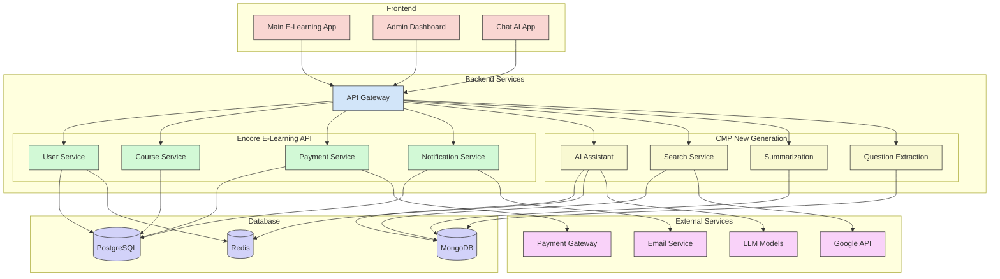

# 🚀 ELP (E-Learning Platform) - CMP (Communication Model Protocol)


<p align="center">
  
</p>

## 📑 Tổng quan

**Capstone E-Learning Platform** là một nền tảng học tập trực tuyến toàn diện được phát triển như một dự án capstone. Hệ thống được thiết kế với kiến trúc microservices, kết hợp công nghệ AI tiên tiến để tạo ra trải nghiệm học tập tương tác và cá nhân hóa cao.

### 📌 Đặc điểm nổi bật

- **Nền tảng học tập đa chức năng** với nội dung khóa học phong phú và tương tác
- **Trợ lý AI thông minh** hỗ trợ việc học tập và trả lời câu hỏi
- **Hệ thống quản lý học tập** toàn diện cho người học và giáo viên
- **Hệ thống quản trị mạnh mẽ** cho phép kiểm soát mọi khía cạnh của nền tảng
- **Kiến trúc microservices** đảm bảo khả năng mở rộng và bảo trì dễ dàng
- **Tích hợp công nghệ AI** để tạo trải nghiệm học tập cá nhân hóa

## 🏗️ Kiến trúc hệ thống



## 🌟 Các thành phần chính

### 1. Frontend Monorepo

Hệ thống frontend được phát triển theo mô hình monorepo gồm 3 ứng dụng chính:

- [**Main E-Learning Application**](./capstone-mono-fe-elearning/README.md): Ứng dụng học tập chính dành cho học viên
- [**Admin Dashboard**](./capstone-mono-fe-elearning/README.md): Giao diện quản trị dành cho giáo viên và quản trị viên
- [**Chat AI Application**](./capstone-mono-fe-elearning/README.md): Ứng dụng trò chuyện AI tích hợp

### 2. Backend Services

Hệ thống backend gồm 2 nhóm dịch vụ chính:

- [**CMP New Generation**](./capstone-be-dev/README.md): Hệ thống xử lý AI và tương tác ngôn ngữ tự nhiên
  - **AI Assistant**: Trợ lý AI cho việc học tập
  - **Search Service**: Dịch vụ tìm kiếm thông tin
  - **Summarization**: Tóm tắt nội dung từ nhiều nguồn
  - **Question Extraction**: Trích xuất câu hỏi từ nội dung

- [**Encore E-Learning API**](./capstone-be-dev/README.md): Hệ thống quản lý dữ liệu và API chính
  - **User Service**: Quản lý người dùng và xác thực
  - **Course Service**: Quản lý khóa học và nội dung
  - **Payment Service**: Xử lý thanh toán và đăng ký
  - **Notification Service**: Quản lý thông báo và email

## 📂 Cấu trúc thư mục dự án

```
capstone-project/
├── capstone-be-dev/                # Backend services
│   ├── cmp_new_generation/         # CMP AI service
│   │   ├── src/                    # Mã nguồn
│   │   ├── tests/                  # Unit tests
│   │   ├── .env.example            # Cấu hình môi trường mẫu
│   │   ├── Dockerfile              # Docker configuration
│   │   └── README.md               # Tài liệu
│   │
│   ├── cp-be-encore-elearn/        # E-Learning API service
│   │   ├── src/                    # Mã nguồn
│   │   ├── tests/                  # Unit tests
│   │   ├── .env.example            # Cấu hình môi trường mẫu
│   │   ├── Dockerfile              # Docker configuration
│   │   └── README.md               # Tài liệu
│   │
│   ├── docker-compose.yml          # Docker compose configuration
│   └── README.md                   # Backend documentation
│
├── capstone-mono-fe-elearning/     # Frontend monorepo
│   ├── main-e-learning/            # Main student application
│   │   ├── public/                 # Static files
│   │   ├── src/                    # Source code
│   │   └── README.md               # Documentation
│   │
│   ├── admin-e-learning/           # Admin dashboard
│   │   ├── public/                 # Static files
│   │   ├── src/                    # Source code
│   │   └── README.md               # Documentation
│   │
│   ├── chat-ai-llms-fintune/       # AI Chat application
│   │   ├── public/                 # Static files
│   │   ├── src/                    # Source code
│   │   └── README.md               # Documentation
│   │
│   ├── shared/                     # Shared components and utilities
│   └── README.md                   # Frontend documentation
│
├── scripts/                        # Utility scripts
├── docs/                           # Project documentation
├── .github/                        # GitHub workflows
├── docker-compose.yml              # Root docker compose
└── README.md                       # This file
```

## 📋 Bảng tính năng

| Tính năng | Trạng thái | Mô tả |
|-----------|---------|-------------|
| Quản lý người dùng | ✅ | Đăng ký, đăng nhập, quản lý hồ sơ |
| Quản lý khóa học | ✅ | Tạo, chỉnh sửa, xem khóa học |
| Quản lý nội dung | ✅ | Upload và tổ chức nội dung học tập |
| Trợ lý AI | ✅ | Hỗ trợ học tập bằng AI |
| Tìm kiếm thông tin | ✅ | Tìm kiếm thông tin từ internet |
| Tóm tắt nội dung | ✅ | Tự động tóm tắt nội dung dài |
| Trích xuất câu hỏi | ✅ | Tạo câu hỏi ôn tập từ nội dung |
| Thanh toán | ✅ | Xử lý thanh toán khóa học |
| Thông báo | ✅ | Gửi thông báo đến người dùng 
| Chấm Code | ✅ | Chấm code realtime |
| CMP | ✅ | AI tự thảo luận |
| Phân tích dữ liệu | ✅ | Thống kê và báo cáo |
| Học tập cộng tác | 🔜 | Học nhóm và tương tác |
| Ứng dụng di động | 🔜 | Phiên bản cho điện thoại và máy tính bảng |

> Lưu ý còn rất nhiều tính năng trong ứng dụng, đây chỉ là tính năng quan trọng.

*Chú thích: ✅ Hoàn thành | ⏳ Đang phát triển | 🔜 Dự kiến*

## 🚀 Khởi động dự án

### Yêu cầu hệ thống
- Docker và Docker Compose
- Node.js 18+ (cho phát triển frontend)
- Python 3.10+ (cho phát triển backend)
- Git

### Cài đặt với Docker

```bash
# Clone repository
git clone https://github.com/yourusername/capstone-project.git
cd capstone-project

# Khởi động toàn bộ hệ thống
docker-compose up -d

# Hoặc khởi động từng phần riêng biệt
docker-compose up -d frontend  # Chỉ khởi động frontend
docker-compose up -d backend   # Chỉ khởi động backend
```

### Cài đặt thủ công

```bash
# Clone repository
git clone https://github.com/yourusername/capstone-project.git
cd capstone-project

# Cài đặt và chạy backend
cd capstone-be-dev
# Xem hướng dẫn chi tiết trong README của các service

# Cài đặt và chạy frontend
cd capstone-mono-fe-elearning
npm install
npm run bootstrap
npm run dev
```

## 🧪 Testing

```bash
# Chạy tất cả tests
npm run test

# Chạy tests cho backend
cd capstone-be-dev
# Xem hướng dẫn chi tiết trong README của các service

# Chạy tests cho frontend
cd capstone-mono-fe-elearning
npm run test
```

## 📢 API Documentation

API documentation có sẵn qua Swagger UI sau khi khởi động các services:

- Encore E-Learning API: http://localhost:8000/docs
- CMP New Generation API: http://localhost:8001/docs

## 👥 Đóng góp

1. Fork project
2. Tạo nhánh feature (`git checkout -b feature/amazing-feature`)
3. Commit thay đổi (`git commit -m 'Add some amazing feature'`)
4. Push nhánh (`git push origin feature/amazing-feature`)
5. Tạo Pull Request

## 📄 Giấy phép

Dự án này được cấp phép theo Giấy phép MIT - xem file [LICENSE](LICENSE) để biết chi tiết.

## 📞 Liên hệ

- **Nguyễn Phương Anh Tú** - Lead Developer
- **YouTube**: [https://www.youtube.com/@Dev8Sync/featured](https://www.youtube.com/@Dev8Sync/featured)
- **Facebook**: [https://www.facebook.com/8sync](https://www.facebook.com/8sync)
- **TikTok**: [https://www.tiktok.com/@8_sync](https://www.tiktok.com/@8_sync)
- **Zalo**: [https://zalo.me/0703930513](https://zalo.me/0703930513)
- **Zalo Group**: [https://zalo.me/g/mitxdi486](https://zalo.me/g/mitxdi486)
- **Email**: 8sync.dev.1111@gmail.com
- **Website**: [https://8syncdev.com/](https://8syncdev.com/)

---

© 2023-2024 Capstone E-Learning Project Team
