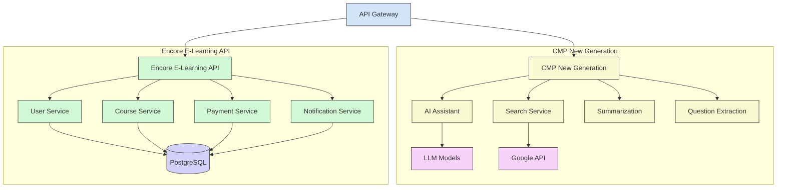

# 🖥️ Backend Services - Capstone E-Learning Platform

<p align="center">
  
</p>

## 📑 Tổng quan

Backend của Nền tảng E-Learning bao gồm hai dịch vụ chính:

1. **CMP New Generation**: Hệ thống xử lý trí tuệ nhân tạo và ngôn ngữ tự nhiên
2. **Encore E-Learning API**: API chính cho các chức năng quản lý học tập

Các dịch vụ này được thiết kế theo kiến trúc microservices, cho phép phát triển, triển khai và mở rộng độc lập.

## 🏗️ Kiến trúc



## 🧩 Dịch vụ CMP New Generation

CMP (Communication Model Protocol) New Generation là hệ thống xử lý trí tuệ nhân tạo, tập trung vào việc cung cấp các tính năng AI cho nền tảng E-Learning.

### 📋 Chức năng chính

- **AI Assistant**: Trợ lý AI cho giáo viên và học viên
- **Search Service**: Tìm kiếm thông tin từ internet và các nguồn học liệu khác
- **Summarization Engine**: Tự động tóm tắt nội dung từ văn bản, URL, và tài liệu
- **Question Extraction**: Tự động trích xuất câu hỏi từ nội dung học tập
- **Meeting Facilitation**: Hỗ trợ tổ chức và ghi chép cuộc họp giữa giáo viên và học viên

### 🔄 API Endpoints chính

| Endpoint | Mô tả | Method |
|----------|-------|--------|
| `/search-google` | Tìm kiếm thông tin từ Google | POST |
| `/get-content-from-url` | Lấy nội dung từ URL | POST |
| `/get-content-from-urls` | Lấy nội dung từ nhiều URL | POST |
| `/summarize` | Tóm tắt nội dung | POST |
| `/ask-teacher` | Đặt câu hỏi cho giáo viên qua AI | POST |
| `/meeting-with-teacher` | Tạo cuộc họp với giáo viên | POST |
| `/student-ask-teacher` | Học viên đặt câu hỏi cho giáo viên | POST |
| `/extract-questions` | Trích xuất câu hỏi từ nội dung | POST |

### 🛠️ Công nghệ sử dụng

- **Framework**: FastAPI
- **AI/ML**: OpenAI API, Google API
- **Database**: MongoDB, Redis
- **Containerization**: Docker
- **Async Processing**: Python asyncio
- **Caching**: Redis for search and query results

### 🚀 Hướng dẫn cài đặt

Xem [CMP New Generation README](./cmp_new_generation/README.md) để biết chi tiết về cài đặt và cấu hình.

## 🧩 Dịch vụ Encore E-Learning API

Encore E-Learning API là hệ thống backend chính cung cấp các API cho nền tảng học tập, quản lý người dùng, khóa học, nội dung và các chức năng chính của hệ thống.

### 📋 Chức năng chính

- **User Service**: Quản lý người dùng và xác thực
  - Đăng ký và đăng nhập người dùng
  - Quản lý vai trò và phân quyền
  - Quản lý hồ sơ người dùng
  
- **Course Service**: Quản lý khóa học và nội dung học tập
  - Tạo và quản lý khóa học
  - Quản lý bài học và tài liệu
  - Theo dõi tiến độ học tập
  
- **Payment Service**: Xử lý thanh toán và đăng ký khóa học
  - Tích hợp với các cổng thanh toán
  - Quản lý gói đăng ký và giấy phép
  - Báo cáo và thống kê doanh thu
  
- **Notification Service**: Quản lý thông báo và email
  - Thông báo realtime
  - Gửi email tự động
  - Lịch học và nhắc nhở

### 🔄 API Endpoints chính

| Endpoint | Mô tả | Method |
|----------|-------|--------|
| `/auth/login` | Đăng nhập người dùng | POST |
| `/auth/register` | Đăng ký người dùng mới | POST |
| `/users` | Quản lý người dùng | GET/POST/PUT |
| `/courses` | Quản lý khóa học | GET/POST/PUT/DELETE |
| `/lessons` | Quản lý bài học | GET/POST/PUT/DELETE |
| `/enrollments` | Quản lý đăng ký khóa học | GET/POST |
| `/payments` | Quản lý thanh toán | GET/POST |
| `/notifications` | Quản lý thông báo | GET/POST |
| `/analytics` | Dữ liệu phân tích | GET |
| `/search` | Tìm kiếm nội dung | GET |

### 🛠️ Công nghệ sử dụng

- **Framework**: Django Rest Framework
- **Database**: PostgreSQL
- **Cache**: Redis
- **Authentication**: JWT, OAuth2
- **Containerization**: Docker
- **Search**: Elasticsearch
- **Media Storage**: AWS S3 / MinIO
- **Websockets**: Django Channels

### 🚀 Hướng dẫn cài đặt

Xem [Encore E-Learning API README](./cp-be-encore-elearn/README.md) để biết chi tiết về cài đặt và cấu hình.

## 🔄 API Gateway

API Gateway là điểm vào chính cho tất cả các yêu cầu API, cung cấp các chức năng sau:

- **Routing**: Điều hướng yêu cầu đến service phù hợp
- **Authentication**: Xác thực người dùng
- **Rate Limiting**: Giới hạn tỷ lệ yêu cầu
- **Logging**: Ghi nhật ký truy cập
- **Caching**: Bộ nhớ đệm cho các yêu cầu thường xuyên
- **Request/Response Transformation**: Chuyển đổi định dạng yêu cầu/phản hồi
- **Load Balancing**: Cân bằng tải giữa các phiên bản service

## 💻 Môi trường Phát triển

### Yêu cầu hệ thống

- **Python**: 3.9+
- **Docker & Docker Compose**: Phiên bản mới nhất
- **Git**: Phiên bản mới nhất
- **PostgreSQL**: 13+
- **MongoDB**: 5+
- **Redis**: 6+

### IDE được khuyến nghị

- **PyCharm Professional**
- **Visual Studio Code** với các extension:
  - Python
  - Docker
  - REST Client
  - MongoDB for VS Code
  - PostgreSQL

## 🚀 Khởi động dịch vụ

### Sử dụng Docker Compose

```bash
# Clone repository
git clone https://github.com/yourusername/capstone-project.git
cd capstone-project/capstone-be-dev

# Cấu hình biến môi trường
cp .env.example .env
# Chỉnh sửa file .env với các thông số phù hợp

# Khởi động tất cả dịch vụ backend
docker-compose up -d

# Hoặc khởi động từng dịch vụ riêng biệt
docker-compose up -d cmp-new-generation
docker-compose up -d encore-elearning-api
```

### Cài đặt thủ công

#### CMP New Generation

```bash
cd cmp_new_generation

# Tạo môi trường ảo Python
python -m venv venv
source venv/bin/activate  # Trên Linux/Mac
# hoặc
venv\Scripts\activate  # Trên Windows

# Cài đặt dependencies
pip install -r requirements.txt

# Cấu hình biến môi trường
cp .env.example .env
# Chỉnh sửa file .env

# Chạy ứng dụng
uvicorn src.main:app --reload --port 8001
```

#### Encore E-Learning API

```bash
cd cp-be-encore-elearn

# Tạo môi trường ảo Python
python -m venv venv
source venv/bin/activate  # Trên Linux/Mac
# hoặc
venv\Scripts\activate  # Trên Windows

# Cài đặt dependencies
pip install -r requirements.txt

# Cấu hình biến môi trường
cp .env.example .env
# Chỉnh sửa file .env

# Thực hiện migrations
python manage.py migrate

# Chạy ứng dụng
python manage.py runserver 8000
```

## 🧪 Testing

### CMP New Generation

```bash
cd cmp_new_generation
source venv/bin/activate  # Trên Linux/Mac

# Chạy tests
pytest

# Chạy tests với coverage
pytest --cov=src
```

### Encore E-Learning API

```bash
cd cp-be-encore-elearn
source venv/bin/activate  # Trên Linux/Mac

# Chạy tests
python manage.py test

# Chạy tests với coverage
coverage run --source='.' manage.py test
coverage report
```

## 📊 Giám sát và Logging

Hệ thống backend sử dụng các công cụ sau để giám sát và ghi log:

- **Logging**: ELK Stack (Elasticsearch, Logstash, Kibana)
- **Metrics**: Prometheus + Grafana
- **Error Tracking**: Sentry
- **Distributed Tracing**: Jaeger
- **Performance Monitoring**: New Relic

## 📚 API Documentation

Sau khi khởi động các dịch vụ, tài liệu API có thể truy cập tại:

- **CMP New Generation API**: http://localhost:8001/docs
- **Encore E-Learning API**: http://localhost:8000/docs

## 📝 Quy trình phát triển

1. **Feature Planning**: Lên kế hoạch tính năng trong Jira
2. **Development**: Phát triển trên branch feature riêng biệt
3. **Code Review**: Tạo Pull Request và được review bởi ít nhất 1 developer khác
4. **Testing**: Unit tests, Integration tests, và Manual tests
5. **Deployment**: CI/CD pipeline tự động triển khai đến môi trường staging
6. **Release**: Triển khai lên production sau khi test và chấp thuận

## ⚠️ Lưu ý khi phát triển

- Luôn sử dụng môi trường ảo Python khi phát triển
- Đảm bảo cập nhật file requirements.txt khi thêm dependencies mới
- Tuân thủ các quy tắc định dạng code (PEP 8)
- Viết tests cho tất cả các chức năng mới
- Cập nhật tài liệu API khi thay đổi endpoints
- Sử dụng type hints trong Python để tăng tính rõ ràng và giảm lỗi
- Sử dụng DocStrings để mô tả các hàm và lớp

## 🔄 CI/CD Pipeline

Dự án sử dụng GitHub Actions cho CI/CD:
- **Continuous Integration**: Tự động chạy tests khi có push hoặc pull request
- **Continuous Deployment**: Tự động triển khai đến môi trường staging khi merge vào branch develop
- **Production Deployment**: Triển khai đến môi trường production khi tạo release mới

## 📚 Tài liệu bổ sung

- [Kiến trúc hệ thống](./docs/architecture.md)
- [Quy trình phát triển](./docs/development-process.md)
- [Tích hợp API](./docs/api-integration.md)
- [Giám sát và Vận hành](./docs/monitoring-operations.md)
- [Bảo mật](./docs/security.md)

## 👥 Đóng góp

Vui lòng đọc [CONTRIBUTING.md](./CONTRIBUTING.md) để biết chi tiết về quy trình gửi pull requests.

## 📄 Giấy phép

Dự án này được cấp phép theo [MIT License](./LICENSE).

---

© 2025-2026 Capstone E-Learning Project Team
