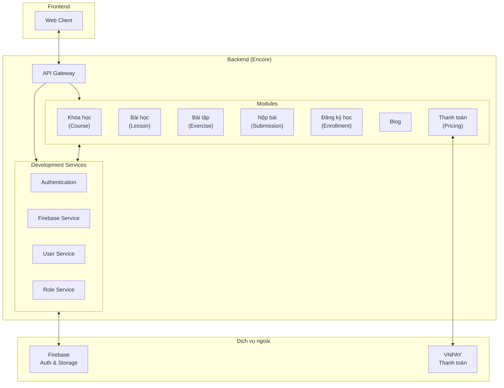
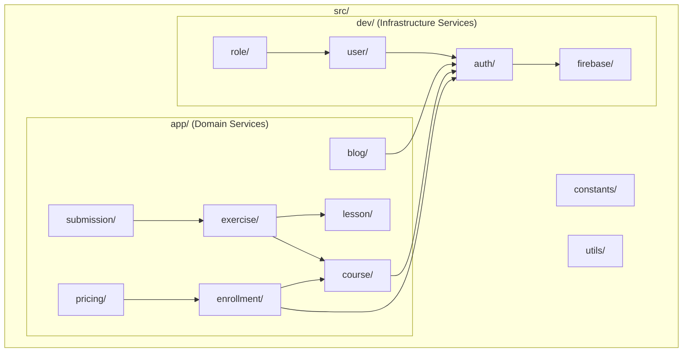
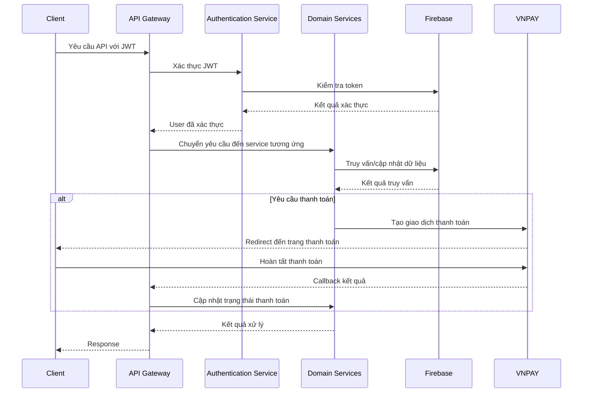
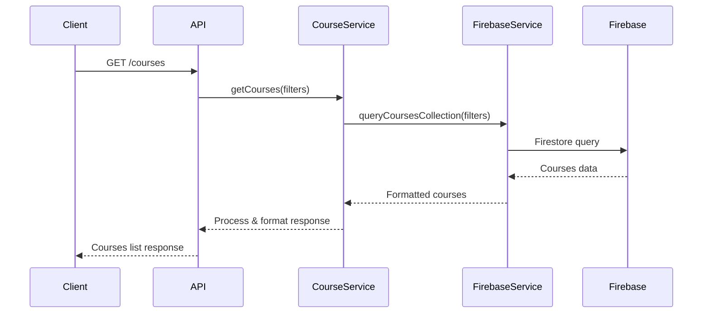
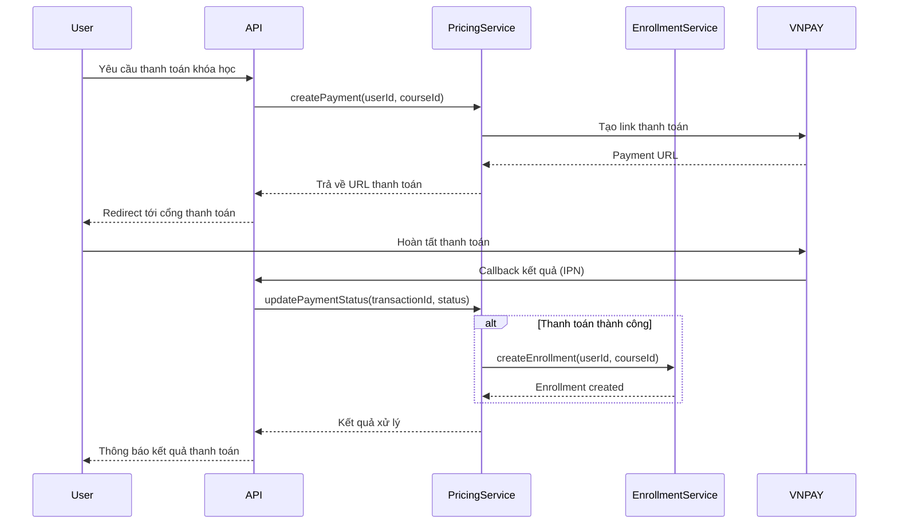

# E-learning Encore

## 📑 Mục lục
- [Giới thiệu chung](#giới-thiệu-chung)
- [Kiến trúc tổng quan](#kiến-trúc-tổng-quan)
- [Phân tích kiến trúc Microservice](#phân-tích-kiến-trúc-microservice)
- [Phân tích chi tiết từng module](#phân-tích-chi-tiết-từng-module)
- [Hướng dẫn cài đặt & chạy](#hướng-dẫn-cài-đặt--chạy)
- [Ví dụ sử dụng](#ví-dụ-sử-dụng)
- [Best Practices & Lưu ý](#best-practices--lưu-ý)
- [Triển khai](#triển-khai)
- [Phụ lục](#phụ-lục)
- [License](#license)

## 🌟 Giới thiệu chung
E-learning Encore là nền tảng học trực tuyến được phát triển với mục đích cung cấp các khóa học chất lượng cao, tương tác và dễ tiếp cận. Dự án sử dụng Encore làm framework phát triển backend, kết hợp với Firebase cho việc xác thực và lưu trữ.

### Tính năng chính:
- **Quản lý khóa học**: Tạo, chỉnh sửa và quản lý nội dung khóa học.
- **Bài học và bài tập**: Hỗ trợ nhiều định dạng nội dung học tập.
- **Theo dõi tiến độ học tập**: Giám sát quá trình học của người dùng.
- **Xác thực người dùng**: Đăng nhập, đăng ký qua Firebase.
- **Thanh toán trực tuyến**: Tích hợp VNPAY cho việc thanh toán khóa học.
- **Blog nội dung**: Chia sẻ kiến thức và thông tin về các khóa học.

## 🏗️ Kiến trúc tổng quan



## 🔬 Phân tích kiến trúc Microservice

Hệ thống E-learning Encore được xây dựng theo kiến trúc microservice tận dụng framework Encore để phân chia các chức năng thành các dịch vụ độc lập, dễ dàng mở rộng và bảo trì.

### Cấu trúc thư mục và quan hệ giữa các microservice



### Phân lớp kiến trúc

Hệ thống được tổ chức theo các lớp sau:

1. **API Gateway**: Điểm vào duy nhất cho tất cả các yêu cầu từ client, tự động được tạo bởi Encore.
2. **Domain Services** (src/app/): Các dịch vụ nghiệp vụ chính của hệ thống, mỗi dịch vụ xử lý một khía cạnh cụ thể của ứng dụng.
3. **Infrastructure Services** (src/dev/): Các dịch vụ cơ sở hạ tầng phục vụ cho các dịch vụ nghiệp vụ.
4. **Shared Components** (src/utils/ và src/constants/): Các tiện ích và hằng số được chia sẻ giữa các dịch vụ.

### Luồng dữ liệu giữa các Microservice



## 📊 Phân tích chi tiết từng module

### 1. Module Khóa học (Course)
Module này quản lý toàn bộ thông tin liên quan đến khóa học trong hệ thống, đóng vai trò là core service của nền tảng.

**Chức năng chính:**
- Tạo và quản lý thông tin khóa học
- Phân loại khóa học theo danh mục
- Quản lý nội dung và tài liệu khóa học
- Theo dõi số lượng học viên đăng ký
- Xác định các điều kiện tiên quyết cho khóa học

**Mô hình dữ liệu chính:**
```typescript
interface Course {
  id: string;
  title: string;
  description: string;
  category: string;
  level: 'beginner' | 'intermediate' | 'advanced';
  price: number;
  imageUrl: string;
  instructorId: string;
  lessons: string[]; // Reference to lesson IDs
  createdAt: Date;
  updatedAt: Date;
  isPublished: boolean;
}
```



### 2. Module Bài học (Lesson)
Quản lý nội dung chi tiết của từng bài học trong khóa học.

**Chức năng chính:**
- Tạo và quản lý nội dung bài học
- Hỗ trợ nhiều loại nội dung (text, video, PDF)
- Theo dõi thời gian học và tiến độ của học viên
- Liên kết đến bài tập và tài liệu tham khảo

**Mô hình dữ liệu chính:**
```typescript
interface Lesson {
  id: string;
  courseId: string;
  title: string;
  content: string;
  videoUrl?: string;
  attachments: string[];
  order: number;
  durationMinutes: number;
  createdAt: Date;
  updatedAt: Date;
}
```

### 3. Module Bài tập (Exercise)
Quản lý các bài tập, bài kiểm tra để đánh giá kiến thức người học.

**Chức năng chính:**
- Tạo và quản lý các loại bài tập khác nhau
- Hỗ trợ nhiều định dạng câu hỏi (trắc nghiệm, tự luận, code)
- Thiết lập điểm số và tiêu chí đánh giá
- Tạo deadline và quy tắc nộp bài

**Mô hình dữ liệu chính:**
```typescript
interface Exercise {
  id: string;
  lessonId: string;
  title: string;
  description: string;
  type: 'quiz' | 'assignment' | 'project';
  questions?: Question[];
  maxScore: number;
  deadline?: Date;
  createdAt: Date;
  updatedAt: Date;
}
```

### 4. Module Nộp bài (Submission)
Xử lý quá trình nộp bài và đánh giá kết quả của học viên.

**Chức năng chính:**
- Tiếp nhận và lưu trữ bài làm của học viên
- Đánh giá tự động hoặc hỗ trợ đánh giá thủ công
- Cung cấp phản hồi và đánh giá chi tiết
- Theo dõi lịch sử nộp bài và điểm số

**Mô hình dữ liệu chính:**
```typescript
interface Submission {
  id: string;
  exerciseId: string;
  userId: string;
  content: string;
  attachments?: string[];
  score?: number;
  feedback?: string;
  submittedAt: Date;
  gradedAt?: Date;
  status: 'pending' | 'graded' | 'returned';
}
```

### 5. Module Đăng ký học (Enrollment)
Quản lý quá trình đăng ký và tham gia khóa học của học viên.

**Chức năng chính:**
- Xử lý đăng ký và hủy đăng ký khóa học
- Theo dõi tiến độ học tập của học viên
- Quản lý thời hạn truy cập khóa học
- Báo cáo hoạt động và kết quả học tập

**Mô hình dữ liệu chính:**
```typescript
interface Enrollment {
  id: string;
  userId: string;
  courseId: string;
  progress: number; // percentage
  lastAccessedAt: Date;
  enrolledAt: Date;
  completedAt?: Date;
  certificateIssued: boolean;
  paymentStatus: 'pending' | 'completed' | 'refunded';
}
```

### 6. Module Blog
Quản lý nội dung blog và bài viết liên quan đến khóa học.

**Chức năng chính:**
- Tạo và quản lý bài viết blog
- Phân loại bài viết theo chủ đề
- Hỗ trợ tìm kiếm và lọc bài viết
- Tương tác với người đọc (bình luận, chia sẻ)

**Mô hình dữ liệu chính:**
```typescript
interface BlogPost {
  id: string;
  title: string;
  content: string;
  authorId: string;
  categories: string[];
  tags: string[];
  imageUrl?: string;
  publishedAt: Date;
  updatedAt: Date;
  status: 'draft' | 'published' | 'archived';
}
```

### 7. Module Thanh toán (Pricing)
Xử lý các giao dịch thanh toán cho việc đăng ký khóa học.

**Chức năng chính:**
- Quản lý các gói dịch vụ và giá cả
- Xử lý thanh toán qua VNPAY
- Quản lý hóa đơn và lịch sử giao dịch
- Xử lý hoàn tiền và tranh chấp

**Mô hình dữ liệu chính:**
```typescript
interface Transaction {
  id: string;
  userId: string;
  courseId: string;
  amount: number;
  currency: string;
  paymentMethod: 'vnpay' | 'other';
  status: 'pending' | 'completed' | 'failed' | 'refunded';
  transactionDate: Date;
  vnpayTransactionId?: string;
}
```



### 8. Module Xác thực (Authentication)
Quản lý quá trình xác thực và phân quyền người dùng.

**Chức năng chính:**
- Đăng ký, đăng nhập và quản lý tài khoản
- Xác thực thông qua Firebase Authentication
- Quản lý phiên đăng nhập và token
- Phân quyền và kiểm soát truy cập

**Mô hình dữ liệu chính:**
```typescript
interface User {
  id: string;
  email: string;
  displayName: string;
  photoURL?: string;
  roles: Role[];
  createdAt: Date;
  lastLoginAt?: Date;
  isActive: boolean;
}

enum Role {
  STUDENT = 'student',
  INSTRUCTOR = 'instructor',
  ADMIN = 'admin'
}
```

### 9. Module Firebase Service
Cung cấp các dịch vụ tương tác với Firebase.

**Chức năng chính:**
- Kết nối và quản lý dữ liệu trên Firestore
- Xử lý upload và quản lý tệp trên Firebase Storage
- Quản lý xác thực qua Firebase Authentication
- Xử lý sự kiện và thông báo thông qua Firebase Cloud Functions

## 🚀 Hướng dẫn cài đặt & chạy

### Yêu cầu hệ thống
- Node.js (>= 16.x)
- Encore CLI
- Git

### Các bước cài đặt

1. Clone repository:
```bash
git clone <URL_REPO>
cd cp-be-encore-elearn
```

2. Cài đặt dependencies:
```bash
npm install
```

3. Cấu hình môi trường:
   - Tạo file `.env` từ mẫu `.env.example` (nếu có)
   - Cập nhật các thông tin cấu hình Firebase, VNPAY

4. Chạy ứng dụng:
```bash
npx encore run
```

## 🔍 Ví dụ sử dụng

### Tạo một API endpoint mới

```typescript
import { api } from "encore.dev";

// Định nghĩa endpoint API
export const getCourseById = api.get("/courses/:id", async ({ params }) => {
  // Lấy thông tin khóa học từ ID
  const courseId = params.id;
  
  // Xử lý logic lấy dữ liệu
  const courseData = await fetchCourseData(courseId);
  
  return courseData;
});
```

### Tương tác với Firebase

```typescript
import { initializeApp } from "firebase/app";
import { getFirestore, collection, getDocs } from "firebase/firestore";
import { firebaseConfig } from "../constants/firebase";

// Khởi tạo Firebase
const app = initializeApp(firebaseConfig);
const db = getFirestore(app);

// Lấy danh sách khóa học
export async function getAllCourses() {
  const coursesCollection = collection(db, "courses");
  const coursesSnapshot = await getDocs(coursesCollection);
  return coursesSnapshot.docs.map(doc => ({ id: doc.id, ...doc.data() }));
}
```

## ⚠️ Best Practices & Lưu ý

### Bảo mật
- **Không commit file .env** vào repository
- Luôn kiểm tra quyền truy cập trong các API endpoint
- Sử dụng Firebase Authentication đúng cách

### Hiệu suất
- Tối ưu truy vấn Firebase để giảm chi phí và thời gian phản hồi
- Sử dụng caching cho dữ liệu tĩnh
- Tối ưu kích thước payload API

### Mở rộng ứng dụng
- Tuân thủ kiến trúc module hóa
- Viết unit test cho các service
- Sử dụng logging đầy đủ để dễ dàng debug

## 🌩️ Triển khai

### Triển khai với Encore

Encore cung cấp workflow triển khai đơn giản:

```bash
# Triển khai môi trường staging
npx encore env staging create
npx encore deploy --env=staging

# Triển khai môi trường production
npx encore env production create
npx encore deploy --env=production
```

### Docker (tùy chọn)

```dockerfile
FROM node:16-alpine

WORKDIR /app

COPY package*.json ./
RUN npm install

COPY . .

CMD ["npx", "encore", "run"]

EXPOSE 9400
```

## 📚 Phụ lục

### Links tham khảo
- [Encore Documentation](https://encore.dev/docs)
- [Firebase Documentation](https://firebase.google.com/docs)
- [TypeScript Documentation](https://www.typescriptlang.org/docs/)
- [VNPAY API Documentation](https://sandbox.vnpayment.vn/apis/)
- [Microservices Architecture Design Patterns](https://microservices.io/patterns/index.html)
- [Firebase Firestore Best Practices](https://firebase.google.com/docs/firestore/best-practices)

### Các công cụ và thư viện
- **Encore**: Framework phát triển backend với kiến trúc microservice
- **Firebase**: Authentication, Firestore, và Cloud Storage
- **Drizzle ORM**: ORM cho cơ sở dữ liệu
- **TypeScript**: Ngôn ngữ lập trình chính
- **gray-matter**: Xử lý Markdown với frontmatter cho nội dung bài học
- **bcrypt**: Mã hóa mật khẩu

## 📝 License
Mozilla Public License 2.0 (MPL-2.0)


