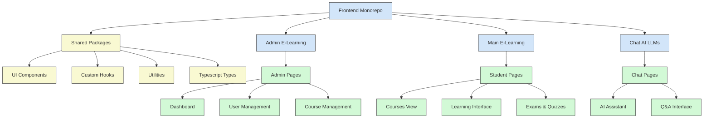

# 🖥️ Frontend Monorepo - Capstone E-Learning Platform

<p align="center">
  
</p>

## 📑 Tổng quan

Frontend của Nền tảng E-Learning được tổ chức dưới dạng monorepo, bao gồm ba ứng dụng chính:

1. **Admin E-Learning**: Giao diện quản trị cho quản lý hệ thống
2. **Main E-Learning**: Ứng dụng chính cho người học
3. **Chat AI LLMs Finetune**: Ứng dụng tương tác với trợ lý AI

Monorepo này sử dụng Turborepo để quản lý các package, chia sẻ thành phần, và đơn giản hóa quy trình phát triển.

## 🏗️ Kiến trúc tổng thể



## 🔄 Tương tác với Backend

Frontend của nền tảng E-Learning tương tác với hai backend chính:

1. **API Backend (cp-be-encore-elearn)**: Xử lý các chức năng chính của nền tảng E-Learning như quản lý người dùng, khóa học, và nội dung.
2. **AI Backend (cmp_new_generation)**: Xử lý các chức năng AI như trợ lý học tập, trả lời câu hỏi, và gợi ý nội dung.

## 🧩 Ứng dụng Admin E-Learning

Admin E-Learning là giao diện quản trị cho quản lý hệ thống E-Learning.

### 📋 Chức năng chính

- **Dashboard**: Bảng điều khiển với thống kê và đồ thị
- **User Management**: Quản lý người dùng và phân quyền
- **Course Management**: Quản lý khóa học, bài học, và tài liệu
- **Content Management**: Quản lý nội dung học tập
- **Analytics**: Phân tích dữ liệu học tập

### 🛠️ Công nghệ sử dụng

- **Framework**: Next.js 14
- **Style**: Tailwind CSS, Shadcn UI
- **State Management**: Zustand
- **Form Handling**: React Hook Form, Zod
- **Authentication**: JWT, NextAuth.js
- **Data Fetching**: TanStack Query, Axios

### 🚀 Hướng dẫn chi tiết

Xem [Admin E-Learning README](./admin-e-learning/README.md) để biết chi tiết về cài đặt và cấu hình.

## 🧩 Ứng dụng Main E-Learning

Main E-Learning là ứng dụng chính cho người học, cung cấp giao diện học tập và tương tác với nội dung khóa học.

### 📋 Chức năng chính

- **Course Catalog**: Danh mục khóa học và tìm kiếm
- **Learning Interface**: Giao diện học tập với video, bài đọc, và tài liệu
- **Progress Tracking**: Theo dõi tiến độ học tập
- **Assessments**: Kiểm tra, bài tập, và đánh giá
- **Social Learning**: Tương tác với giáo viên và học viên khác

### 🛠️ Công nghệ sử dụng

- **Framework**: Next.js 14
- **Style**: Tailwind CSS, Shadcn UI
- **State Management**: Zustand
- **Video Player**: Video.js, HLS.js
- **Data Fetching**: TanStack Query, Axios
- **Authentication**: JWT, NextAuth.js

### 🚀 Hướng dẫn chi tiết

Xem [Main E-Learning README](./main-e-learning/README.md) để biết chi tiết về cài đặt và cấu hình.

## 🧩 Ứng dụng Chat AI LLMs Finetune

Chat AI LLMs Finetune là ứng dụng tương tác với trợ lý AI, giúp người học tương tác với nội dung học tập thông qua hỏi đáp thông minh.

### 📋 Chức năng chính

- **AI Assistant**: Trợ lý AI cho học tập
- **Question Answering**: Hỏi đáp thông minh dựa trên nội dung học tập
- **Content Recommendations**: Đề xuất nội dung học tập
- **Learning Path**: Gợi ý lộ trình học tập
- **Personalization**: Cá nhân hóa trải nghiệm học tập

### 🛠️ Công nghệ sử dụng

- **Framework**: Next.js 14
- **Style**: Tailwind CSS, Shadcn UI
- **AI Integration**: Vercel AI SDK
- **Chat UI**: AI Chat Components
- **Vector Database**: Pinecone, Supabase
- **Authentication**: JWT, NextAuth.js

### 🚀 Hướng dẫn chi tiết

Xem [Chat AI LLMs Finetune README](./chat-ai-llms-fintune/README.md) để biết chi tiết về cài đặt và cấu hình.

## 📦 Shared Packages

Monorepo sử dụng các package chung để chia sẻ mã nguồn giữa các ứng dụng:

- **@shared/ui**: Thư viện UI components chung
- **@shared/hooks**: Custom React hooks
- **@shared/utils**: Tiện ích và functions chung
- **@shared/types**: TypeScript types và interfaces
- **@shared/api**: API clients và utilities

## 🚀 Khởi động dự án

### Yêu cầu hệ thống

- Node.js 18+ (khuyến khích sử dụng Node.js 20)
- npm, yarn hoặc pnpm

### Cài đặt dependencies

```bash
# Clone repository
git clone https://github.com/yourusername/capstone-project.git
cd capstone-project/capstone-mono-fe-elearning

# Cài đặt dependencies
npm install
# hoặc
yarn install
# hoặc
pnpm install
```

### Cấu hình môi trường

Mỗi ứng dụng có file `.env` riêng. Sao chép từ file `.env.example` và điều chỉnh theo môi trường của bạn:

```bash
cp admin-e-learning/.env.example admin-e-learning/.env
cp main-e-learning/.env.example main-e-learning/.env
cp chat-ai-llms-fintune/.env.example chat-ai-llms-fintune/.env
```

### Khởi động phát triển

```bash
# Khởi động tất cả ứng dụng
npm run dev
# hoặc
yarn dev
# hoặc
pnpm dev

# Khởi động một ứng dụng cụ thể
npm run dev --filter=admin-e-learning
# hoặc
yarn workspace admin-e-learning dev
# hoặc
pnpm --filter admin-e-learning dev
```

### Build

```bash
# Build tất cả ứng dụng
npm run build
# hoặc
yarn build
# hoặc
pnpm build

# Build một ứng dụng cụ thể
npm run build --filter=admin-e-learning
# hoặc
yarn workspace admin-e-learning build
# hoặc
pnpm --filter admin-e-learning build
```

## 🧪 Testing

```bash
# Chạy tests cho tất cả ứng dụng
npm run test
# hoặc
yarn test
# hoặc
pnpm test

# Chạy tests cho một ứng dụng cụ thể
npm run test --filter=admin-e-learning
# hoặc
yarn workspace admin-e-learning test
# hoặc
pnpm --filter admin-e-learning test
```

## 📈 CI/CD Pipeline

Dự án sử dụng GitHub Actions cho CI/CD:

- **Lint & Test**: Kiểm tra lỗi code và chạy unit tests khi có pull request
- **Preview Deployment**: Triển khai bản preview trên Vercel khi có pull request
- **Production Deployment**: Triển khai lên môi trường production khi merge vào nhánh main

## 🔄 Quy trình phát triển

1. **Branch Model**: 
   - `main`: Nhánh chính, luôn ở trạng thái sẵn sàng triển khai
   - `develop`: Nhánh phát triển, nơi tích hợp các tính năng mới
   - `feature/tên-tính-năng`: Nhánh phát triển tính năng cụ thể
   - `hotfix/tên-lỗi`: Nhánh sửa lỗi khẩn cấp

2. **Quy trình làm việc**:
   - Tạo branch từ `develop` cho tính năng mới
   - Phát triển và test trên branch đó
   - Tạo pull request vào `develop`
   - Review code và merge
   - Định kỳ merge `develop` vào `main` để triển khai

## 📚 Tài liệu bổ sung

- [Tài liệu Next.js](https://nextjs.org/docs)
- [Tailwind CSS](https://tailwindcss.com/docs)
- [Shadcn UI](https://ui.shadcn.com)
- [Turborepo](https://turbo.build/repo/docs)

## 🤝 Đóng góp

Vui lòng xem [CONTRIBUTING.md](./CONTRIBUTING.md) để biết chi tiết về quy trình đóng góp.

## 📄 Giấy phép

Dự án này được phân phối theo giấy phép [MIT](./LICENSE). 