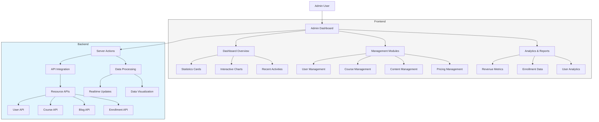

# 🔐 Admin E-Learning Dashboard

## 📑 Mục lục
- [Tổng quan dự án](#tổng-quan-dự-án)
- [Kiến trúc hệ thống](#kiến-trúc-hệ-thống)
- [Tính năng chính](#tính-năng-chính)
- [Cấu trúc dự án](#cấu-trúc-dự-án)
- [Công nghệ sử dụng](#công-nghệ-sử-dụng)
- [Cài đặt và chạy](#cài-đặt-và-chạy)
- [Hướng dẫn phát triển](#hướng-dẫn-phát-triển)
- [Triển khai](#triển-khai)
- [Đóng góp](#đóng-góp)

## 🌟 Tổng quan dự án

Admin E-Learning Dashboard là một ứng dụng quản trị mạnh mẽ được xây dựng trên nền tảng Next.js 15.2.2 với App Router. Dự án cung cấp giao diện quản lý toàn diện cho hệ thống học tập trực tuyến, cho phép quản trị viên theo dõi, quản lý và phân tích dữ liệu của nền tảng.

### Mục tiêu
- Xây dựng hệ thống quản trị toàn diện cho nền tảng e-learning
- Cung cấp công cụ phân tích dữ liệu và báo cáo thời gian thực
- Quản lý người dùng, khóa học, bài học và thanh toán
- Tối ưu hóa trải nghiệm quản trị viên với giao diện hiện đại và thân thiện

## 🏗️ Kiến trúc hệ thống



## ✨ Tính năng chính

### 1. Bảng điều khiển thông minh
- **Tổng quan thống kê**: Hiển thị các chỉ số quan trọng (KPI) của hệ thống
- **Biểu đồ tương tác**: Theo dõi xu hướng đăng ký, doanh thu và hoạt động người dùng
- **Cập nhật thời gian thực**: Theo dõi hoạt động hệ thống theo thời gian thực

### 2. Quản lý người dùng
- **Danh sách người dùng**: Quản lý tất cả người dùng trong hệ thống
- **Phân quyền**: Quản lý vai trò và quyền hạn của người dùng
- **Phê duyệt/vô hiệu hóa**: Kiểm soát trạng thái tài khoản người dùng

### 3. Quản lý khóa học và nội dung
- **Quản lý khóa học**: Tạo, cập nhật và xóa khóa học
- **Quản lý bài học**: Tổ chức nội dung bài học trong khóa học
- **Quản lý bài tập**: Tạo và quản lý bài tập thực hành
- **Quản lý blog**: Xuất bản và quản lý nội dung blog

### 4. Quản lý gói dịch vụ và thanh toán
- **Cấu hình gói dịch vụ**: Tạo và quản lý các gói đăng ký
- **Theo dõi thanh toán**: Quản lý và xác minh thanh toán
- **Báo cáo doanh thu**: Phân tích và xuất báo cáo doanh thu

### 5. Công cụ phân tích nâng cao
- **Báo cáo tùy chỉnh**: Tạo báo cáo dựa trên nhiều tiêu chí
- **Phân tích người dùng**: Hiểu hành vi và nhu cầu người dùng
- **Dự báo xu hướng**: Phân tích dữ liệu để dự đoán xu hướng tương lai

## 📁 Cấu trúc dự án

```
admin-e-learning/
├── app/                          # Next.js App Router
│   ├── (base)/                   # Base layout structure
│   │   ├── (dashboard)/          # Dashboard routes
│   │   │   ├── (index)/          # Dashboard home page
│   │   │   │   ├── _components/  # Dashboard components
│   │   │   │   └── page.tsx      # Dashboard main page
│   │   │   └── (navs)/           # Navigation structure
│   │   │       └── apis/         # API management routes
│   │   │           ├── user/     # User management
│   │   │           ├── course/   # Course management
│   │   │           ├── lesson/   # Lesson management
│   │   │           ├── blog/     # Blog management
│   │   │           ├── pricing/  # Pricing management
│   │   │           └── ...       # Other resource routes
│   │   └── (auth)/               # Authentication routes
│   └── dashboard/                # Alternative dashboard route
├── components/                   # React components
│   ├── dashboard/                # Dashboard specific components
│   │   ├── components/           # Smaller dashboard components
│   │   │   ├── app-sidebar.tsx   # Main sidebar component
│   │   │   ├── nav-main.tsx     # Main navigation
│   │   │   └── ...               # Other components
│   │   └── layouts/              # Dashboard layouts
│   ├── ui/                       # Shared UI components (shadcn)
│   └── shared/                   # Shared utility components
├── providers/                    # Context providers
│   └── realtime-provider.tsx     # Realtime data context
├── hooks/                        # Custom React hooks
├── lib/                          # Utility libraries
└── public/                       # Static assets
```

## 🛠️ Công nghệ sử dụng

### Frontend
- **Next.js 15.2.2**: React framework với App Router
- **React 19.0.0**: UI library
- **TypeScript**: Type-safe JavaScript
- **TailwindCSS 4**: Utility-first CSS framework
- **Shadcn/ui**: Headless UI components
- **Recharts**: Thư viện biểu đồ hiệu suất cao
- **React Hook Form**: Form validation
- **Zod**: Schema validation
- **TanStack Table**: Quản lý bảng dữ liệu

### State Management & Utils
- **React Context API**: Quản lý state toàn cục
- **date-fns & dayjs**: Xử lý thời gian và ngày tháng
- **Sonner**: Toast notifications
- **react-day-picker**: UI chọn ngày hiện đại
- **Lucide React**: Thư viện icon chất lượng cao

## 💻 Cài đặt và chạy

### Yêu cầu hệ thống
- Node.js 18.17 hoặc cao hơn
- npm hoặc yarn

### Cài đặt
1. Clone repository:
```bash
git clone https://github.com/your-username/admin-e-learning.git
cd admin-e-learning
```

2. Cài đặt dependencies:
```bash
npm install
# hoặc
yarn install
```

3. Thiết lập file môi trường:
```bash
cp .env.example .env.local
# Cập nhật các biến môi trường cần thiết
```

### Chạy môi trường phát triển
```bash
npm run dev
# hoặc
yarn dev
```

Truy cập [http://localhost:3000](http://localhost:3000) để xem ứng dụng.

## 🧩 Hướng dẫn phát triển

### Thêm API quản lý mới

1. Tạo thư mục mới trong `app/(base)/(dashboard)/(navs)/apis/[resource-name]/`
2. Tạo các file cần thiết:
   - `page.tsx`: Trang chính hiển thị danh sách
   - `[id]/page.tsx`: Trang chi tiết/chỉnh sửa
   - `create/page.tsx`: Trang tạo mới

Ví dụ cho API quản lý mới:
```typescript
// app/(base)/(dashboard)/(navs)/apis/new-resource/page.tsx
import { DataTable } from '@/components/ui/data-table'
import { columns } from './columns'
import { getResources } from '@/lib/api'

export default async function ResourcePage() {
  const resources = await getResources()
  
  return (
    <div className="container mx-auto py-4">
      <h1 className="text-2xl font-bold mb-4">Quản lý tài nguyên</h1>
      <DataTable columns={columns} data={resources} />
    </div>
  )
}
```

### Thêm biểu đồ mới

Sử dụng Recharts để thêm biểu đồ vào dashboard:

```tsx
import { ResponsiveContainer, LineChart, Line, XAxis, YAxis, CartesianGrid, Tooltip, Legend } from 'recharts'

const data = [
  { name: 'Jan', value: 400 },
  { name: 'Feb', value: 300 },
  // ...more data
]

export function MyNewChart() {
  return (
    <div className="p-4 border rounded-lg bg-card">
      <h3 className="text-lg font-medium mb-4">Biểu đồ mới</h3>
      <ResponsiveContainer width="100%" height={300}>
        <LineChart data={data}>
          <CartesianGrid strokeDasharray="3 3" />
          <XAxis dataKey="name" />
          <YAxis />
          <Tooltip />
          <Legend />
          <Line type="monotone" dataKey="value" stroke="#8884d8" />
        </LineChart>
      </ResponsiveContainer>
    </div>
  )
}
```

## 🚀 Triển khai

### Triển khai trên Vercel

1. Push code lên GitHub repository
2. Kết nối repository với Vercel
3. Cấu hình các biến môi trường
4. Deploy

```bash
npm run build
# Kiểm tra build trước khi deploy
```

### Triển khai Docker

1. Tạo Dockerfile:
```dockerfile
FROM node:18-alpine
WORKDIR /app
COPY package*.json ./
RUN npm install
COPY . .
RUN npm run build
EXPOSE 3000
CMD ["npm", "start"]
```

2. Build và chạy Docker container:
```bash
docker build -t admin-e-learning .
docker run -p 3000:3000 admin-e-learning
```

## 🤝 Đóng góp

Chúng tôi chào đón mọi đóng góp! Vui lòng làm theo các bước sau:

1. Fork repository
2. Tạo branch mới (`git checkout -b feature/amazing-feature`)
3. Commit thay đổi (`git commit -m 'Add some amazing feature'`)
4. Push lên branch (`git push origin feature/amazing-feature`)
5. Mở Pull Request

---

Được phát triển bởi Nguyễn Phương Anh Tú và Cộng sự. © 2024
