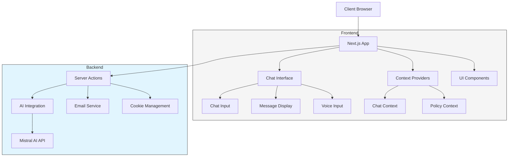

# 🤖 Chat AI LLMs Fine-tune

## 📑 Mục lục
- [Tổng quan dự án](#tổng-quan-dự-án)
- [Kiến trúc hệ thống](#kiến-trúc-hệ-thống)
- [Tính năng chính](#tính-năng-chính)
- [Cấu trúc dự án](#cấu-trúc-dự-án)
- [Công nghệ sử dụng](#công-nghệ-sử-dụng)
- [Cài đặt và chạy](#cài-đặt-và-chạy)
- [Hướng dẫn phát triển](#hướng-dẫn-phát-triển)
- [API Integration](#api-integration)
- [Triển khai](#triển-khai)
- [Đóng góp](#đóng-góp)

## 🌟 Tổng quan dự án

Chat AI LLMs Fine-tune là một ứng dụng chat thông minh được xây dựng trên nền tảng Next.js 15.1.3 với App Router. Dự án tích hợp các mô hình ngôn ngữ lớn (LLMs) từ Mistral AI để cung cấp trải nghiệm trò chuyện tương tác và hỗ trợ người dùng trong việc trả lời các câu hỏi về lập trình và công nghệ.

### Mục tiêu
- Xây dựng giao diện chat AI thân thiện với người dùng
- Tích hợp LLMs để cung cấp câu trả lời chính xác và hữu ích
- Hỗ trợ nhiều ngôn ngữ với trọng tâm là tiếng Việt
- Đa dạng hóa trải nghiệm người dùng với các gói dịch vụ khác nhau

## 🏗️ Kiến trúc hệ thống



## ✨ Tính năng chính

### 1. Trò chuyện thông minh
- **Giao diện chat trực quan**: Thiết kế hiện đại, dễ sử dụng
- **Hỗ trợ Markdown**: Định dạng văn bản, code blocks, danh sách
- **Phản hồi real-time**: Sử dụng streaming để hiển thị câu trả lời theo thời gian thực

### 2. Voice-to-Text
- **Nhập liệu giọng nói**: Chuyển đổi giọng nói thành văn bản
- **Hỗ trợ đa ngôn ngữ**: Nhận dạng cả tiếng Việt và tiếng Anh
- **Xử lý tự động**: Điều chỉnh và tối ưu văn bản được chuyển đổi

### 3. Hệ thống phân cấp người dùng
- **Gói dùng thử (Trial)**: Giới hạn 20 tin nhắn, 1 ngày lưu trữ
- **Gói thông dụng (Normal)**: 50 tin nhắn, lưu trữ 7 ngày
- **Gói VIP**: Không giới hạn tin nhắn, lưu trữ 30 ngày, phản hồi nhanh hơn

### 4. Quản lý conversation
- **Lưu trữ lịch sử**: Lưu và quản lý các cuộc trò chuyện trước đó
- **Tùy chỉnh ngữ cảnh**: Sử dụng lịch sử để tạo ngữ cảnh phù hợp
- **Giới hạn token**: Tối ưu hóa số lượng token cho mỗi câu trả lời

### 5. Tích hợp AI nâng cao
- **Fine-tuned models**: Sử dụng các mô hình được tinh chỉnh
- **Prompt engineering**: Thiết kế prompt hiệu quả cho câu trả lời chất lượng
- **Context awareness**: Phân tích và hiểu ngữ cảnh của cuộc trò chuyện

## 📁 Cấu trúc dự án

```
chat-ai-llms-fintune/
├── app/                           # Next.js App Router
│   ├── chat-ai/                   # Core chat functionality
│   │   ├── components/            # Chat UI components
│   │   │   ├── chat-ai-client.tsx # Main chat client component
│   │   │   ├── chat-interface.tsx # Chat interface UI
│   │   │   ├── chat-input.tsx     # Message input component
│   │   │   ├── chat-message.tsx   # Message display component
│   │   │   └── voice-to-text.tsx  # Voice input functionality
│   │   ├── constants/             # Configuration constants
│   │   │   ├── languages.ts       # Supported languages
│   │   │   └── policies.ts        # User policy definitions
│   │   ├── contexts/              # React contexts
│   │   │   └── chat-context.tsx   # Chat state management
│   │   ├── types/                 # TypeScript type definitions
│   │   └── utils/                 # Utility functions
│   ├── (base)/                    # Base layout routes
│   ├── (auth)/                    # Authentication routes
│   └── layout.tsx                 # Root layout
├── components/                    # Shared components
│   ├── ui/                        # UI components (shadcn)
│   ├── shared/                    # Shared components
│   └── pages/                     # Page-specific components
├── server/                        # Server-side functionality
│   ├── chat-ai.actions.ts         # Chat AI server actions
│   ├── email.actions.ts           # Email functionality
│   └── cookie.actions.ts          # Cookie management
├── providers/                     # Context providers
├── hooks/                         # Custom React hooks
├── lib/                           # Utility libraries
├── public/                        # Static assets
└── .env                           # Environment variables
```

## 🛠️ Công nghệ sử dụng

### Frontend
- **Next.js 15.1.3**: React framework với App Router
- **React 19.0.0**: UI library
- **TypeScript**: Type-safe JavaScript
- **TailwindCSS**: Utility-first CSS framework
- **Shadcn/ui**: Headless UI components
- **Framer Motion**: Animation library
- **Markdown-to-JSX**: Markdown rendering
- **Sonner**: Toast notifications

### AI & Server
- **AI SDK**: Next.js AI integration
- **Mistral AI API**: LLM model integration
- **Server Actions**: Backend functionality
- **Streaming responses**: Real-time AI responses
- **API streamable values**: RSC integration

### Các tính năng đặc biệt
- **Voice-to-Text**: Chuyển đổi giọng nói thành văn bản
- **Code highlighting**: Syntax highlighting cho code blocks
- **Token-aware responses**: Quản lý giới hạn token
- **Policy-based access**: Phân quyền dựa trên gói dịch vụ

## 💻 Cài đặt và chạy

### Yêu cầu hệ thống
- Node.js 18.17 hoặc cao hơn
- npm hoặc yarn

### Cài đặt
1. Clone repository:
```bash
git clone https://github.com/your-username/chat-ai-llms-fintune.git
cd chat-ai-llms-fintune
```

2. Cài đặt dependencies:
```bash
npm install
# hoặc
yarn install
```

3. Thiết lập file môi trường:
```bash
cp .env.example .env.local
```

4. Cập nhật các biến môi trường trong `.env.local`:
```env
MISTRAL_API_KEY=your_mistral_api_key
NORMAL_EXPIRE=2025-02-07T14:30:00.000Z
```

### Chạy môi trường phát triển
```bash
npm run dev
# hoặc
yarn dev
```

Truy cập [http://localhost:3000](http://localhost:3000) để xem ứng dụng.

## 🧩 Hướng dẫn phát triển

### Tùy chỉnh gói dịch vụ

Các gói dịch vụ được định nghĩa trong `app/chat-ai/constants/policies.ts`. Bạn có thể thêm hoặc sửa đổi các gói dịch vụ:

```typescript
export const CHAT_POLICIES = {
  custom: {
    name: 'Tùy chỉnh',
    maxMessages: 100,
    maxTokens: 1500,
    responseSpeed: 'normal',
    voiceEnabled: true,
    historyDays: 14,
    historyLimit: 15
  },
  // Thêm các gói khác...
}
```

### Tùy chỉnh Chat UI

Để tùy chỉnh giao diện chat, bạn có thể chỉnh sửa các components trong `app/chat-ai/components/`:

1. `chat-interface.tsx`: Layout tổng thể của giao diện chat
2. `chat-message.tsx`: Hiển thị tin nhắn
3. `chat-input.tsx`: Component nhập liệu

### Thêm ngôn ngữ mới

Để thêm ngôn ngữ mới, cập nhật file `app/chat-ai/constants/languages.ts`:

```typescript
export const SUPPORTED_LANGUAGES = {
  vi: {
    name: 'Tiếng Việt',
    code: 'vi-VN'
  },
  en: {
    name: 'English',
    code: 'en-US'
  },
  // Thêm ngôn ngữ mới ở đây
};
```

## 🔌 API Integration

### Tích hợp Mistral AI

Chat AI sử dụng Mistral AI thông qua Server Actions. Bạn có thể tùy chỉnh prompt system và model trong `server/chat-ai.actions.ts`:

```typescript
const { textStream } = streamText({
  model: mistral('pixtral-12b-2409'), // Thay đổi model tại đây
  system: `Tôi là Assistant, một chuyên gia lập trình. Trả lời theo các quy tắc sau:
  - Trả lời dựa trên ${historyLimit} tin nhắn gần nhất
  - Đảm bảo an toàn và không gây hại
  - Giới hạn trong ${maxTokens} token
  - Trả lời ngắn gọn, dễ hiểu`,  // Tùy chỉnh prompt system
  messages: validHistory,
  maxTokens: maxTokens,
});
```

### Sử dụng ChatAIClient component

Bạn có thể nhúng Chat AI vào bất kỳ trang nào bằng cách sử dụng `ChatAIClient` component:

```tsx
import { ChatAIClient } from '@/app/chat-ai';

export default function MyPage() {
  return (
    <div>
      <h1>My Chat Page</h1>
      <ChatAIClient 
        showPolicySelector={true}
        initialPolicy="normal"
        expiresIn="2025-02-07T14:30:00.000Z"
        apiKey="your_api_key"
      />
    </div>
  );
}
```

## 🚀 Triển khai

### Triển khai trên Vercel

1. Push code lên GitHub repository
2. Kết nối repository với Vercel
3. Cấu hình các biến môi trường:
   - `MISTRAL_API_KEY`
   - `NORMAL_EXPIRE`
4. Deploy

```bash
npm run build
# Kiểm tra build trước khi deploy
```

### Triển khai Docker

1. Tạo Dockerfile:
```dockerfile
FROM node:18-alpine
WORKDIR /app
COPY package*.json ./
RUN npm install
COPY . .
RUN npm run build
EXPOSE 3000
CMD ["npm", "start"]
```

2. Build và chạy Docker container:
```bash
docker build -t chat-ai-llms .
docker run -p 3000:3000 -e MISTRAL_API_KEY=your_key chat-ai-llms
```

## 🤝 Đóng góp

Chúng tôi chào đón mọi đóng góp! Vui lòng làm theo các bước sau:

1. Fork repository
2. Tạo branch mới (`git checkout -b feature/amazing-feature`)
3. Commit thay đổi (`git commit -m 'Add some amazing feature'`)
4. Push lên branch (`git push origin feature/amazing-feature`)
5. Mở Pull Request

---

Được phát triển bởi Nguyễn Phương Anh Tú và Cộng sự. © 2024
