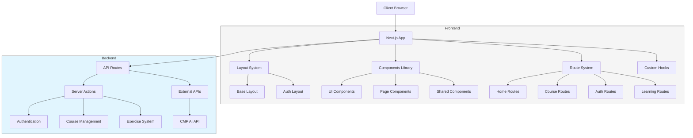

# 🎓 NextJS E-Learning Platform

## 📑 Mục lục
- [Tổng quan dự án](#tổng-quan-dự-án)
- [Kiến trúc hệ thống](#kiến-trúc-hệ-thống)
- [Tính năng chính](#tính-năng-chính)
- [Cấu trúc dự án](#cấu-trúc-dự-án)
- [Công nghệ sử dụng](#công-nghệ-sử-dụng)
- [Cài đặt và chạy](#cài-đặt-và-chạy)
- [Hướng dẫn phát triển](#hướng-dẫn-phát-triển)
- [Triển khai](#triển-khai)
- [Đóng góp](#đóng-góp)
- [Giấy phép](#giấy-phép)

## 🌟 Tổng quan dự án

NextJS E-Learning Platform là một nền tảng học tập trực tuyến hiện đại được xây dựng trên công nghệ Next.js 15.1.2 với App Router. Dự án cung cấp môi trường học tập toàn diện với các khóa học, bài tập thực hành, và tích hợp AI để hỗ trợ học viên.

### Mục tiêu
- Cung cấp nền tảng học tập trực tuyến toàn diện
- Tích hợp AI để cá nhân hóa trải nghiệm học tập
- Xây dựng giao diện người dùng hiện đại, thân thiện
- Hỗ trợ đa thiết bị và đa nền tảng

## 🏗️ Kiến trúc hệ thống



## ✨ Tính năng chính

### 1. Quản lý khóa học
- **Danh mục khóa học**: Hiển thị tất cả các khóa học có sẵn
- **Chi tiết khóa học**: Thông tin chi tiết về khóa học
- **Tiến độ học tập**: Theo dõi tiến độ hoàn thành khóa học

### 2. Hệ thống bài tập
- **Bài tập tương tác**: Thực hành với môi trường code tích hợp
- **Kiểm tra tự động**: Đánh giá bài làm tự động
- **Phản hồi chi tiết**: Nhận xét chi tiết để cải thiện

### 3. Trợ lý AI
- **Hỗ trợ học tập**: Trợ lý AI trả lời câu hỏi về bài học
- **Gợi ý cá nhân hóa**: Đề xuất nội dung học tập dựa trên tiến độ
- **Phân tích lỗi**: Giúp học viên hiểu và sửa lỗi trong bài tập

### 4. Tài khoản người dùng
- **Đăng ký/Đăng nhập**: Hệ thống xác thực an toàn
- **Hồ sơ cá nhân**: Quản lý thông tin cá nhân
- **Theo dõi tiến trình**: Xem quá trình học tập

### 5. Thanh toán
- **Hệ thống thanh toán**: Tích hợp nhiều phương thức thanh toán
- **Mô hình đăng ký**: Các gói đăng ký khác nhau
- **Quản lý đăng ký**: Theo dõi và quản lý đăng ký

## 📁 Cấu trúc dự án

```
main-e-learning/
├── app/                      # Next.js App Router
│   ├── (base)/               # Các route cơ bản
│   │   ├── (home)/           # Trang chủ
│   │   ├── (auth)/           # Các route xác thực
│   │   ├── blog/             # Blog và tin tức
│   │   ├── contact/          # Liên hệ
│   │   ├── courses/          # Danh sách và chi tiết khóa học
│   │   ├── exercises/        # Bài tập thực hành
│   │   ├── learning/         # Môi trường học tập
│   │   ├── payment/          # Thanh toán
│   │   ├── pricing/          # Bảng giá
│   │   └── profile/          # Hồ sơ người dùng
│   ├── fonts/                # Font cho dự án
│   └── styles/               # CSS toàn cục
├── components/               # React components
│   ├── pages/                # Page components
│   │   ├── auth/             # Components trang xác thực
│   │   ├── blog/             # Components trang blog
│   │   ├── home/             # Components trang chủ
│   │   └── payment/          # Components trang thanh toán
│   ├── shared/               # Shared components
│   │   ├── common/           # Common UI elements
│   │   ├── dev/              # Development tools
│   │   └── ui/               # UI library components
│   └── ui/                   # Shadcn UI components
├── constants/                # Hằng số và cấu hình
├── data/                     # Data statik và mocks
├── docs/                     # Tài liệu
├── hooks/                    # Custom React hooks
├── lib/                      # Thư viện tiện ích
├── providers/                # Context providers
├── prompt/                   # Prompt templates cho AI
├── public/                   # Static assets
└── seo/                      # SEO configuration
```

## 🛠️ Công nghệ sử dụng

### Frontend
- **Next.js 15.1.2**: Framework React với App Router
- **React 19.0.0**: Thư viện UI
- **TypeScript**: Typed JavaScript
- **TailwindCSS**: Utility-first CSS framework
- **Shadcn/ui**: Headless UI components
- **Framer Motion**: Animation library
- **React Hook Form**: Form validation
- **Zod**: Schema validation

### Tích hợp
- **CMP API**: Communication Model Protocol cho tích hợp AI
- **Next Auth**: Authentication
- **Nodemailer**: Email service

### DevTools
- **TurboPack**: Bundler nhanh hơn cho Next.js
- **ESLint**: Linting JavaScript/TypeScript
- **Prettier**: Code formatting

## 💻 Cài đặt và chạy

### Yêu cầu hệ thống
- Node.js 18.17 hoặc cao hơn
- npm hoặc yarn

### Cài đặt
1. Clone repository:
```bash
git clone https://github.com/your-username/nextjs-e-learning.git
cd nextjs-e-learning
```

2. Cài đặt dependencies:
```bash
npm install
# hoặc
yarn install
```

3. Thiết lập file môi trường:
```bash
cp .env.example .env.local
# Cập nhật các biến môi trường cần thiết
```

### Chạy môi trường phát triển
```bash
npm run dev
# hoặc
yarn dev
```

Truy cập [http://localhost:3000](http://localhost:3000) để xem ứng dụng.

## 🧩 Hướng dẫn phát triển

### Thêm UI Components

Dự án sử dụng shadcn/ui. Để thêm một component mới:

```bash
npx shadcn@latest add [component-name]
```

Ví dụ:
```bash
npx shadcn@latest add button
```

### Cấu trúc trang mới

1. Tạo thư mục mới trong `app/(base)/`
2. Thêm file `page.tsx` với component trang
3. Tạo components trong `components/pages/[page-name]/`
4. Import và sử dụng trong `page.tsx`

### Sử dụng CMP API

Để tích hợp với CMP API (Communication Model Protocol):

```typescript
import { useCMP } from '@/providers/cmp-context';

const MyComponent = () => {
  const { askQuestion } = useCMP();
  
  const handleQuestion = async () => {
    const response = await askQuestion('How do I learn JavaScript?');
    // Process response
  };
  
  return (
    // Component JSX
  );
};
```

## 🚀 Triển khai

### Triển khai trên Vercel

1. Push code lên GitHub repository
2. Kết nối repository với Vercel
3. Cấu hình các biến môi trường
4. Deploy

```bash
npm run build
# Kiểm tra build trước khi deploy
```

### Triển khai Docker

1. Build Docker image:
```bash
docker build -t nextjs-e-learning .
```

2. Chạy container:
```bash
docker run -p 3000:3000 nextjs-e-learning
```

## 🤝 Đóng góp

Chúng tôi chào đón mọi đóng góp! Vui lòng làm theo các bước sau:

1. Fork repository
2. Tạo branch mới (`git checkout -b feature/amazing-feature`)
3. Commit thay đổi (`git commit -m 'Add some amazing feature'`)
4. Push lên branch (`git push origin feature/amazing-feature`)
5. Mở Pull Request

## 📄 Giấy phép

Dự án được phân phối dưới giấy phép MIT. Xem `LICENSE` để biết thêm thông tin.

---

Được phát triển bởi Nguyễn Phương Anh Tú và Cộng sự. © 2024
